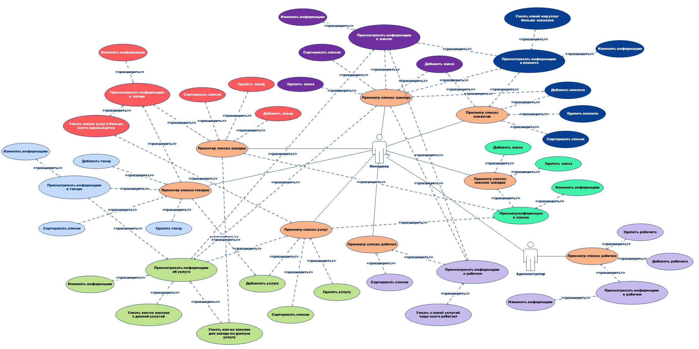
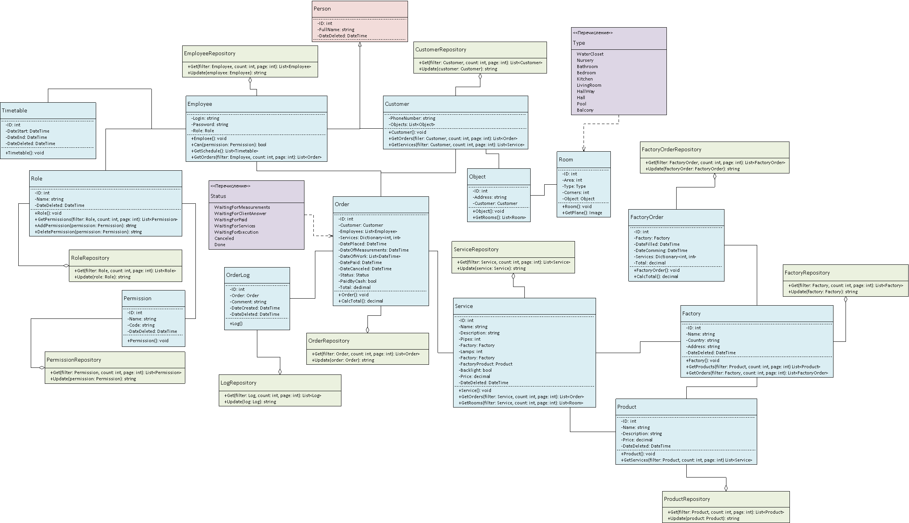
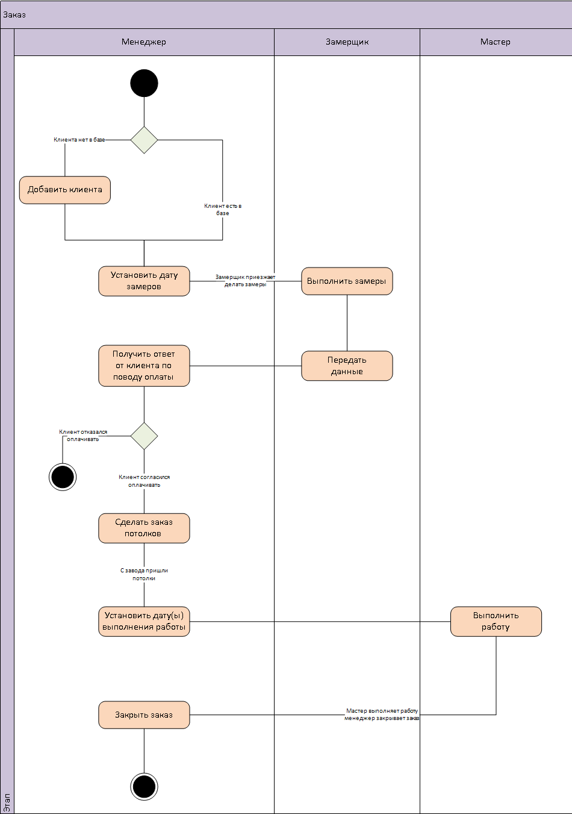

# UML

В данном репозитори содержаться UML диаграммы для объяснения работы продкута, реализирующего упрощение работы бизнеса по установке натяжных потолков

## Диаграммы

### 1. Диагрмма прецедентов

Данная диаграмма показывает как взаимодействуют пользователи с системой. В данном случае у нас есть **Менеджер**, который выполняет огромный спекрт задач, например, ***Просмотр списка заказов*** и т.д., а также **Администратор**, который унаследовал от **Менеджера** все его возможности и имеет несколько своих собственных.

### 2. Диагрмма классов

Данная даиграмма показывает взаимодействие классов между собой.

Обозначения:
* **Зеленым** обозначены классы **Одиночки**, которые будут взаимодействовать с [базой данных](https://github.com/romankravchuk/sqlite_database_and_queries).
* **Красным** обозначен класс **Родитель**, от которого наследуются другие классы.
* **Синим** обозначены **Модели** классов, которые будут хранить в себе значения из базы данных, взаимодействовать между собой и пользователем.
* **Фиолетовым** обозначены **Перечисления**.

### 3. Диагрмма действий

Данная диаграмма описывает какие действия будут происходить в программе, во время обработки заказа.

### 4. Диагрмма состояний

Данная диаграма описывает состояния Заказа.

