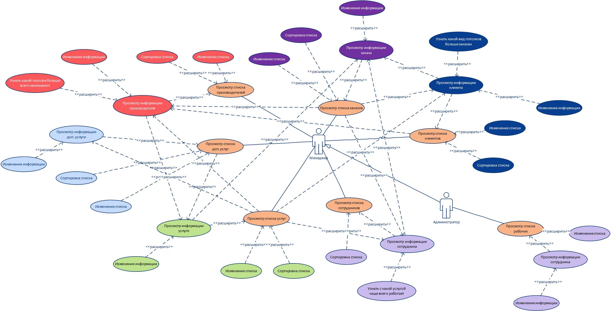
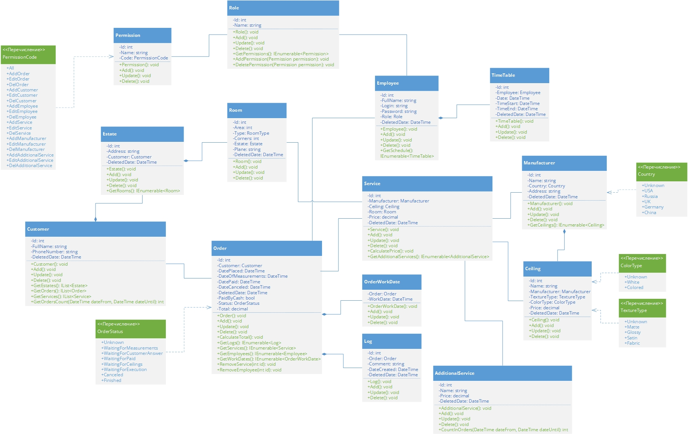
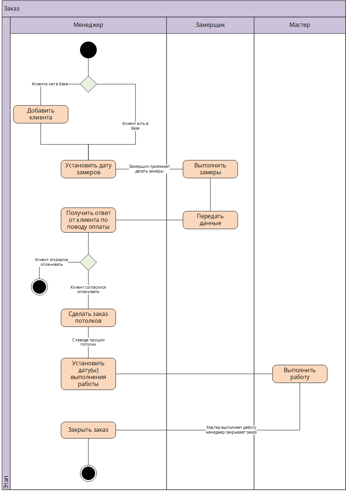
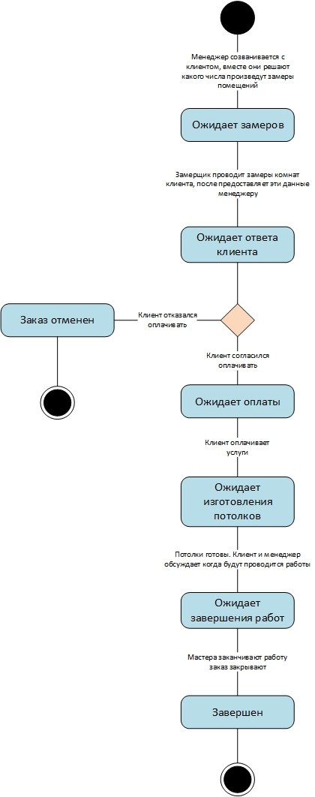
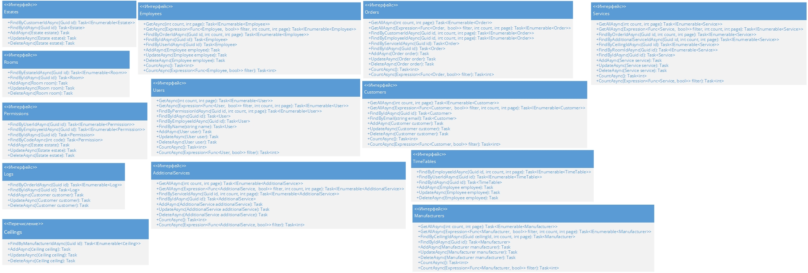
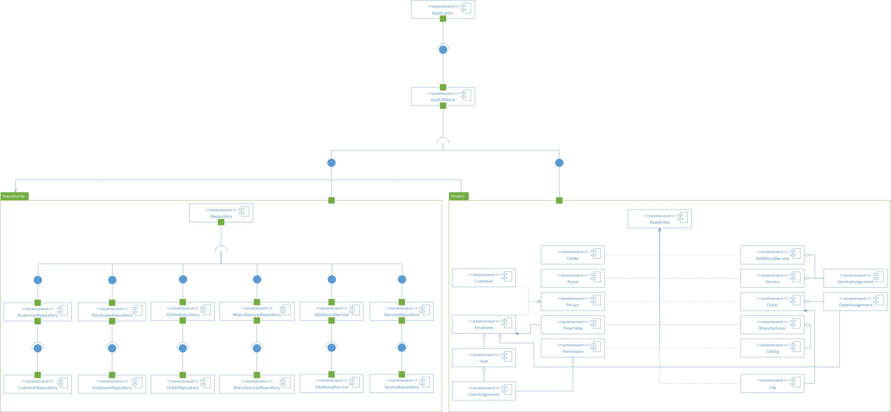
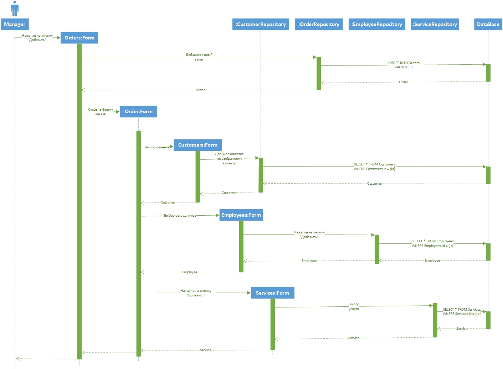
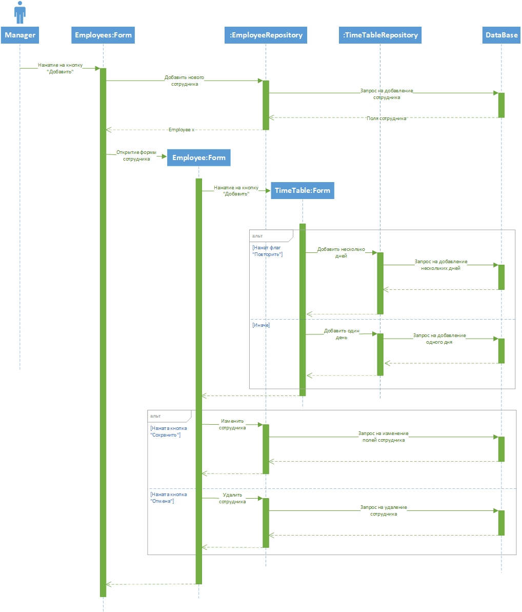

# StretchCeilings UML

В данном репозитори содержаться UML диаграммы для объяснения работы продкута, реализирующего упрощение работы бизнеса по установке натяжных потолков

Целью программы - автоматизировать выполненеие различных видов действий в компании по установки натяжных потолков
для повышения эффективности менеджеров, сбор статистики. Программа позволяет вести удобную работу с клиентами,
учет сотрудников, управлять списком доп. услуг, производителей, быстро формировать заказ на установку потолков.

Задачи, которые решает приложение:

- Быстрое и простое формирование новых заказов и взаимодействие уже с существующими
- Контроль списка доп. услуг
- Контроль списка клиентов
- Контроль списка сотрудников
- Контроль списка производителей
- Отображение статистических данных

## Диаграммы приложения

---

- [Диаграмма прецедентов](#use-case-diagram)  
- [Диаграмма классов](#class-diagram)  
- [Диаграмма действий](#activity-diagram)  
- [Диаграмма состояний](#state-diagram)  
- [Диаграмма интерфейсов API](#api-diagram)  
- [Диаграмма компонентов](#components-diagram)  
- [Диаграммы последовательностей](#sequence-diagram)  

<h3 id='use-case-diagram'>Диаграмма прецедентов</h3>

---

Данная диаграмма показывает как взаимодействуют пользователи с системой.
В данном случае у нас есть **Менеджер**, который выполняет огромный спекрт задач, например, **Просмотр списка заказов**
и т.д., а также **Администратор**, который унаследовал от **Менеджера** все его возможности и имеет несколько своих собственных.

<h3 id='class-diagram'>Диаграмма классов</h3>

---

Данная даиграмма показывает взаимодействие классов между собой.

<h3 id='activity-diagram'>Диаграмма действий</h3>

---

Данная диаграмма описывает какие действия будут происходить в программе, во время обработки заказа.

<h3 id='state-diagram'>Диаграмма состояний</h3>

---

Данная диаграмма описывает состояния Заказа.

<h3 id='api-diagram'>Диагрмма интерфейсов API</h3>

---

Данная диаграмма описывает API интерфейсы приложения

> **Помарка**: Данная диаграма напрямую не реализована в самом приложении, а только показывает,
> как должно выглядить взаимодейтсвие API с другими системами.

<h3 id='components-diagram'>Схема endpoint'ов</h3>

---

Данная диаграмма описывает компонентов приложения.

<h3 id='sequence-diagram'>Диаграммы последовательностей</h3>

---

Данная диаграмма описывает временную последовательность создания заказа

Данная диаграмма описывает временную последовательность добавления сотрудника

