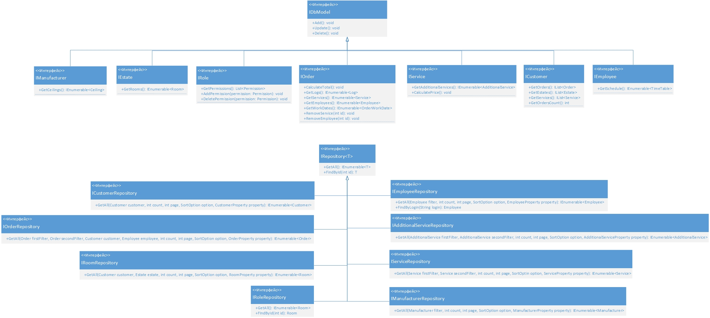

# StretchCeilings UML

В данном репозитори содержаться UML диаграммы для объяснения работы продкута, реализирующего упрощение работы бизнеса по установке натяжных потолков

Целью программы - автоматизировать выполненеие различных видов действий в компании по установки натяжных потолков
для повышения эффективности менеджеров, сбор статистики. Программа позволяет вести удобную работу с клиентами,
учет сотрудников, управлять списком доп. услуг, производителей, быстро формировать заказ на установку потолков.

Задачи, которые решает приложение:
- Быстрое и простое формирование новых заказов и взаимодействие уже с существующими
- Контроль списка доп. услуг
- Контроль списка клиентов
- Контроль списка сотрудников
- Контроль списка производителей
- Отображение статистических данных

## Диаграммы приложения

- Диграмма прецедентов
- Диаграмма классов
- Диаграмма действий
- Диаграмма состояний
- Диаграмма интерфейсов
- Диаграмма компонентов
- Диаграммы последовательностей

### 1. Диагрмма прецедентов

Данная диаграмма показывает как взаимодействуют пользователи с системой. 
В данном случае у нас есть **Менеджер**, который выполняет огромный спекрт задач, например, **Просмотр списка заказов** 
и т.д., а также **Администратор**, который унаследовал от **Менеджера** все его возможности и имеет несколько своих собственных.

### 2. Диагрмма классов

Данная даиграмма показывает взаимодействие классов между собой.

### 3. Диагрмма действий

Данная диаграмма описывает какие действия будут происходить в программе, во время обработки заказа.

### 4. Диагрмма состояний

Данная диаграмма описывает состояния Заказа.

### 5. Диагрмма интерфесов

Данная диаграмма описывает интерфейсы приложения

### 6. Диагрмма компонентов

Данная диаграмма описывает Api приложения.

> **Помарка**: Данная диаграма напрямую не реализована в самом приложении, а только показывает,
> как должно выглядить взаимодействие компонентов с другими системами.

### 7. Диаграммы последовательностей.

Данная диаграмма описывает временную последовательность создания заказа

Данная диаграмма описывает временную последовательность добавления сотрудника

