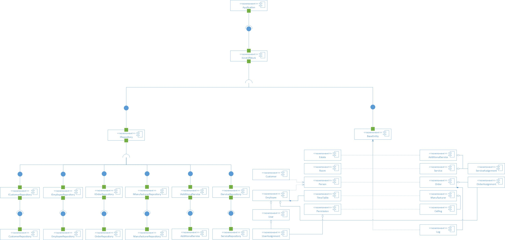

# StretchCeilings UML

В данном репозитори содержаться UML диаграммы для объяснения работы продкута, реализирующего упрощение работы бизнеса по установке натяжных потолков

Целью программы - автоматизировать выполненеие различных видов действий в компании по установки натяжных потолков
для повышения эффективности менеджеров, сбор статистики. Программа позволяет вести удобную работу с клиентами,
учет сотрудников, управлять списком доп. услуг, производителей, быстро формировать заказ на установку потолков.

Задачи, которые решает приложение:

- Быстрое и простое формирование новых заказов и взаимодействие уже с существующими
- Контроль списка доп. услуг
- Контроль списка клиентов
- Контроль списка сотрудников
- Контроль списка производителей
- Отображение статистических данных

## Диаграммы приложения

---

- [Диграмма прецедентов][^use_case]
- [Диаграмма классов][^classes]
- [Диаграмма действий][^activity]
- [Диаграмма состояний][^state]
- [Диаграмма интерфейсов API][^api]
- [Диаграмма компонентов][^components]
- [Диаграммы последовательностей][^sequence]

### 1. Диаграмма прецедентов (Use Case Diagram)

---
[^use_case]: use_case
Данная диаграмма показывает как взаимодействуют пользователи с системой. 
В данном случае у нас есть **Менеджер**, который выполняет огромный спекрт задач, например, **Просмотр списка заказов** 
и т.д., а также **Администратор**, который унаследовал от **Менеджера** все его возможности и имеет несколько своих собственных.

### 2. Диаграмма классов

---

[^classes]: classes
Данная даиграмма показывает взаимодействие классов между собой.

### 3. Диаграмма действий

---

[^activity]: activity
Данная диаграмма описывает какие действия будут происходить в программе, во время обработки заказа.

### 4. Диаграмма состояний (State Diagram)

---

[^state]: state
Данная диаграмма описывает состояния Заказа.

### 5. Диагрмма интерфейсов API

---

[^api]: api
Данная диаграмма описывает API интерфейсы приложения

> **Помарка**: Данная диаграма напрямую не реализована в самом приложении, а только показывает,
> как должно выглядить взаимодейтсвие API с другими системами.

### 6. Схема endpoint'ов

---

[^components]: components
Данная диаграмма описывает компонентов приложения.

### 7. Диаграммы последовательностей.

---

[^sequence]: sequence
Данная диаграмма описывает временную последовательность создания заказа

Данная диаграмма описывает временную последовательность добавления сотрудника

